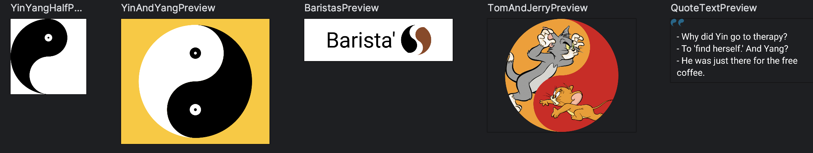
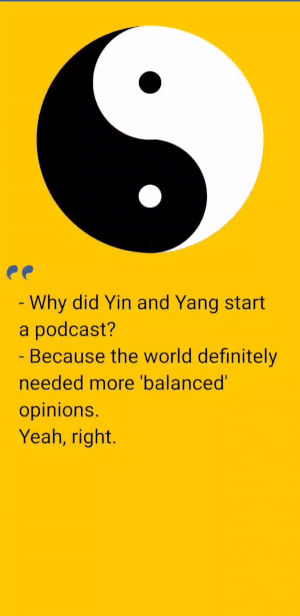
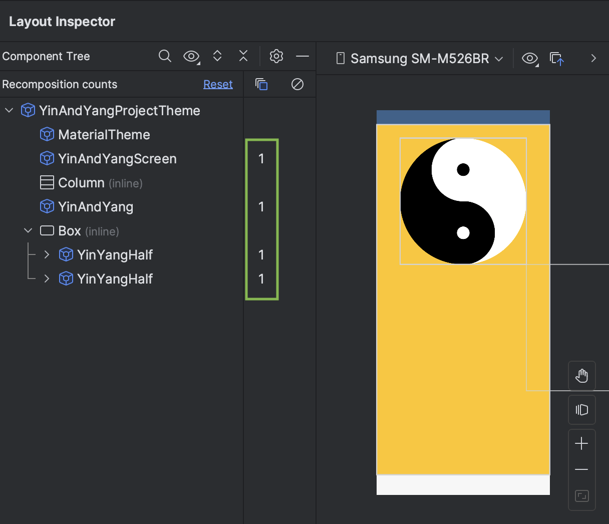

# Jetpack Compose Yin and Yang Tutorial

Welcome to the Jetpack Compose Yin and Yang repository! This project demonstrates different branches, each dedicated to specific aspects of drawing and optimizing animations in Jetpack Compose.

## Branches Overview

### 1. `part1`

This branch provides code examples on drawing the Yin and Yang symbol and more in Jetpack Compose.

### 2. `part_animation`

Explore the `part_animation` branch to learn various animation techniques in Compose.

### 3. `part_recomposition`

The `part_recomposition` branch focuses on taking your animations to the next level by optimizing them for better performance. Discover techniques to reduce recomposition and ensure a smoother and more efficient animation experience.

Feel free to clone this repository and explore each branch to deepen your understanding of drawing, animating, and optimizing animations in Jetpack Compose. Happy coding!
